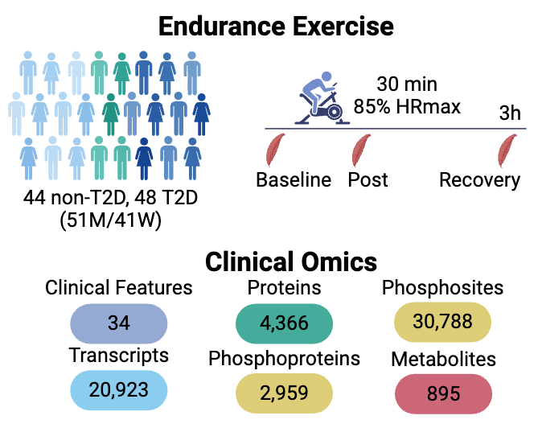
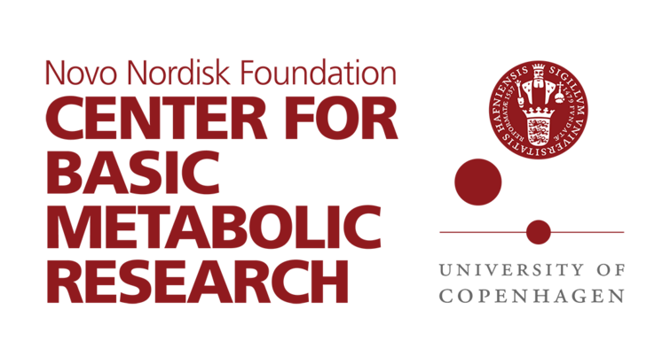

<h1 align="center">MAX — Multi-Omics of Exercise in Type 2 Diabetes</h1>

<p align="center">
  <em>An interactive R Shiny app for exploring the multi-omic response to endurance exercise<br>
  in human skeletal muscle, in people with and without type 2 diabetes.</em>
</p>

<p align="center">
  
</p>

---

## Overview

The **MAX app** accompanies the study *Molecular Pathways of Exercise in Type 2 Diabetes Revealed by Multi-Omics*. It lets you explore, one feature at a time, how mRNA, proteins, phosphorylation sites and metabolites change across an acute endurance-exercise time-course — **Baseline → Post-exercise → Recovery** — in the skeletal muscle of people with type 2 diabetes (**T2D**) and people without (**non-T2D**).

For any gene you can see its response at the level of the **transcriptome, proteome and phosphoproteome** side by side, and break the exercise effect down by **disease status** or **sex**.

## Features

- **Interactive violin plots** (plotly) of feature abundance at Base, Post and Recovery, each with a box-and-whisker overlay.
- **Three comparisons per feature**, switchable via tabs: **Main effect** of exercise, **Type 2 Diabetes** (non-T2D vs T2D) and **Sex** (women vs men).
- **Significance brackets** drawn only for comparisons that survive multiple-testing correction (**adjusted _p_ < 0.05**), annotated with the exact **unadjusted** _p_-value.
- **Informative hover tooltips** — sample size (n), median, quartiles and whiskers for every group.
- **Linked results tables** (DT) with per-group sample sizes and limma statistics (log₂FC, _P_.Value, adj._P_.Val); click a row to jump the plot straight to that omics layer or phosphosite.
- **One-click download** of the on-screen results table.

## App structure

| Tab | Contents |
|-----|----------|
| **Home** | Study background, citation and contact details. |
| **Methods** | How the data were generated, illustrated with the study overview figure. |
| **Genes, Proteins & Phosphosites** | Violin plots and statistics for a chosen gene across mRNA / protein / phosphosite. |
| **Metabolites** | The same, for metabolite features. |
| **Differential abundance** | _Coming soon_ — volcano plots from the limma analyses. |

## Getting started

### Requirements

- **R ≥ 4.5.2**
- **[renv](https://rstudio.github.io/renv/)** — bundled; restores the exact package versions used here.
- **[Git LFS](https://git-lfs.com/)** — the protein data file is tracked with LFS and must be pulled to run the app.

### Install & run

```bash
# 1. Install Git LFS once, then clone (LFS files download automatically)
git lfs install
git clone https://github.com/fpm-cbmr/MAX_shiny.git
cd MAX_shiny
```

```r
# 2. Restore the pinned package versions
renv::restore()

# 3. Launch the app
shiny::runApp()
```

The app is also easiest to open in RStudio via `MAX_shiny.Rproj` and the **Run App** button.

Key packages (all restored by `renv`): `shiny`, `bslib`, `data.table`, `vroom`, `here`, `dplyr`, `ggplot2`, `plotly`, `DT`, `openxlsx`.

## Repository layout

```
MAX_shiny/
├── app.R                     # UI (page_navbar + bslib) and server logic
├── functions/
│   └── functions.R           # violin-plot builders + results-table helpers
├── data/
│   ├── data_files/           # per-sample abundances (data_proteins.txt via Git LFS)
│   └── limma_outputs/        # limma differential-abundance results
├── www/                      # figures and institutional logos
├── renv.lock                 # pinned package versions
└── MAX_shiny.Rproj
```

## Citation

If you use this app, please cite the accompanying publication:

> **Molecular Pathways of Exercise in Type 2 Diabetes Revealed by Multi-Omics**
> Ben Stocks\*, Stephen P. Ashcroft\*, Signe Schmidt Kjølner Hansen, Jeppe Kjærgaard, Kirstin A. MacGregor, Dimitrius Santiago Passos Simões Fróes Guimaraes, David Rizo-Roca, Marc Pielies Avelli, Simon Wengert, Konstantinos Makris, Amy M. Ehrlich, Scott Frendo-Cumbo, Simone Jensen, Mladen Savikj, Roger Moreno-Justicia, Torkil Rogneflåten, Håvard Hamarsland, Daniel Hammarström, Dominik Lutter, Julia Otten, Tommy Olsson, Simon Rasmussen, Kenneth Caidahl, Harriet Wallberg-Henriksson, Anna Krook, Atul S. Deshmukh#, and Juleen R. Zierath#.
>
> <sub>\*Joint first authors &nbsp;·&nbsp; #Co-corresponding authors &nbsp;·&nbsp; _Journal / DOI: to be added._</sub>

## Contact

Questions or trouble using the tool? Get in touch:

- Roger Moreno-Justicia — [roger.moreno.justicia@sund.ku.dk](mailto:roger.moreno.justicia@sund.ku.dk)
- Ben Stocks — [ben.stocks@sund.ku.dk](mailto:ben.stocks@sund.ku.dk)
- Stephen Ashcroft — [stephen.ashcroft@sund.ku.dk](mailto:stephen.ashcroft@sund.ku.dk)

## License

This repository does not yet include a license file. Until one is added, please contact the authors before reusing the code or data.

---

<p align="center">
  
  &nbsp;&nbsp;&nbsp;&nbsp;
  
</p>
